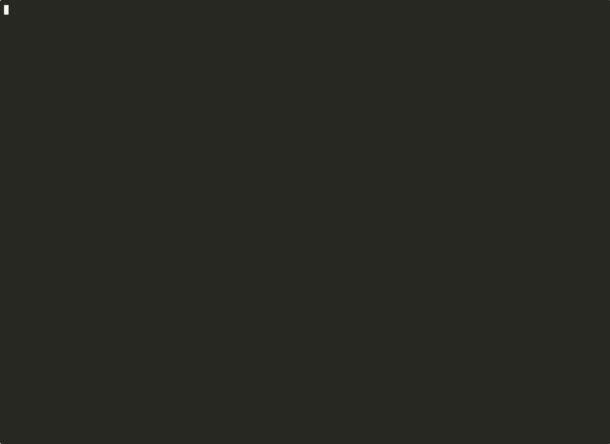

## Вступ

*Minikube* — це широко поширений інструмент, призначений для запуску одновузлового кластера Kubernetes на різних операційних системах, включаючи macOS, Linux та Windows. Він надає розробникам простий спосіб локального запуску Kubernetes та ідеально підходить для тестування програм у контрольованому середовищі. Minikube підтримує кілька гіпервізорів, таких як VirtualBox, VMware та HyperKit, що робить його гнучким для різних інфраструктур. Крім того, він пропонує такі функції, як можливість вмикати або вимикати певні компоненти Kubernetes, що дозволяє розробникам налаштовувати своє середовище відповідно до налаштувань робочого середовища. Ця гнучкість є критично важливою для налагодження та забезпечення належної поведінки програм перед розгортанням. 

*Kind*, скорочення від Kubernetes у Docker, — це ще один варіант, який дозволяє користувачам створювати кластери Kubernetes, використовуючи контейнери Docker як вузли. Цей підхід дотримується принципів контейнеризації, що дозволяє швидко налаштовувати та розбирати кластери. Kind особливо корисний для тестування самого Kubernetes і користується популярністю у CI/CD pipelines.
Його здатність запускати кластери в Docker означає, що розробники можуть легко реплікувати свої виробничі середовища у спрощеному вигляді, що робить його чудовим вибором для робочих процесів безперервної інтеграції. Крім того, Kind підтримує багатовузлові кластери, що може бути корисним для моделювання складніших сценаріїв, з якими розробники можуть зіткнутися в реальних додатках.

*K3s*, з іншого боку, — це полегшений дистрибутив Kubernetes, розроблений Rancher Labs. Він має на меті забезпечити спрощену та оптимізовану версію Kubernetes, що робить його придатним для середовищ з обмеженими ресурсами. K3s особливо корисний для периферійних обчислень, IoT-додатків та сценаріїв, де повна інсталяція Kubernetes неможлива через апаратні обмеження. З розміром двійкового файлу менше 100 МБ, K3s розроблений для роботи на пристроях з низьким енергоспоживанням, таких як Raspberry Pi, і може бути швидко та легко розгорнутий. Крім того, K3s має вбудовану підтримку Helm, що спрощує керування додатками та службами в кластері, і він автоматично обробляє поширені завдання, такі як керування сертифікатами та мережею, що може значно зменшити операційні накладні витрати для користувачів.

Youtube Episode: https://www.youtube.com/watch?v=1hwGdey7iUU&t=388s

## Порівняння характеристик

Порівнюючи ключові характеристики Minikube, Kind та K3s, важливо враховувати кілька факторів, що визначають їхню зручність використання та продуктивність: 
- Вимоги до ресурсів: Minikube зазвичай вимагає більше ресурсів, оскільки він запускає повний кластер Kubernetes у віртуальній машині. Kind, хоча й легший за Minikube, все ще вимагає ресурсів Docker, тоді як K3s оптимізований для мінімального споживання ресурсів. 
- Складність встановлення: Minikube пропонує простий процес встановлення, хоча налаштування необхідного гіпервізора може зайняти деякий час. Kind має простішу конфігурацію, яка вимагає лише Docker, тоді як K3s часто можна встановити лише за допомогою кількох команд. 
- Мережа та сховище: Minikube надає повнофункціональний мережевий стек, включаючи підтримку LoadBalancer. Мережевий стек Kind залежить від мережевих можливостей Docker, тоді як K3s включає вбудовані опції для легкого керування мережею та сховищем. 
- Розширюваність: Minikube підтримує доповнення, які можуть легко розширити функціональність. Kind дозволяє користувачам налаштовувати кластери за допомогою файлів конфігурації, а K3s сумісний з екосистемою Kubernetes, дозволяючи використовувати існуючі розширення та API Kubernetes.

### Підтримувані операційні системи

| OS                     | k3s                         | minikube                                        | kind                              |
| ---------------------- | --------------------------- | ----------------------------------------------- | --------------------------------- |
| Linux                  | Yes                         | Yes                                             | Yes                               |
| macOS                  | Not explicitly detailed     | Yes                                             | Yes                               |
| Windows                | Not explicitly detailed     | Yes                                             | Yes                               |
| Installation Method(s) | Script-based, single binary | Package managers (brew, choco), direct download | Package managers, direct download |

### Основні функції для розробників

| distributions | container runtime               | networking                               | storage                                                          | add-ons                                                                                | Podman Support |
| ------------- | ------------------------------- | ---------------------------------------- | ---------------------------------------------------------------- | -------------------------------------------------------------------------------------- | -------------- |
| k3s           | containerd,  cri-dockerd     | Traefik                                  | lightweight datastore based on SQLite                            | support Flannel, CoreDNS, ServiceLB, and Local-path-provisioner. It also supports Helm | No             |
| minikube      | CRI-O, containerd and Docker | Ingress through an easily enabled add-on | Persistent Volumes and allows mounting filesystems from the host | support many add-ons, including the Kubernetes dashboard, Ingress, and metrics-server. | Experimental   |
| kind          | containerd, CRI-O               | Ingress                                  | Persistent volumes require additional configuration              | Limited built-in add-ons                                                               | Solid          |

## Показники продуктивності

Оцінка продуктивності Minikube, Kind та K3s вимагає вивчення різних показників, таких як час запуску, використання ресурсів та стабільність роботи. 
- Час запуску: Kind часто запускається найшвидше, оскільки він безпосередньо використовує контейнери Docker. Minikube може займати більше часу для завантаження через накладні витрати на запуск віртуальної машини, тоді як K3s пропонує швидке розгортання зі зменшеними конфігураціями. 
- Використання ресурсів: K3s сяє в цій категорії, оскільки він розроблений для роботи в умовах обмежених ресурсів. Minikube, як правило, споживає більше оперативної пам'яті та процесора, тоді як підхід Kind на основі Docker може бути ефективнішим, ніж традиційні підходи до віртуальних машин. 
- Стабільність роботи: Усі три довели свою стабільність у різних середовищах; однак K3s включає вбудовану полегшену альтернативу etcd, яка може підвищити надійність та продуктивність у крайніх випадках.
## Демонстрація

Коротка демонстрація k3d  Deployment of "Hello World" Application on Kubernetes

## Встановлення 
### Minikube
1. Переконайтеся, що Docker встановлено. 
2. Встановіть Minikube через менеджер пакетів або завантаживши бінарний файл. 
3. Запустіть Minikube за допомогою команди minikube start. Це налаштує ваш локальний кластер Kubernetes. 
4. Перевірте встановлення за допомогою kubectl get nodes, щоб побачити активний вузол у вашому кластері.

Більше інформації [тут](https://minikube.sigs.k8s.io/docs/start/)
### Kind
1. Переконайтеся, що Docker встановлено та запущено на вашому комп'ютері. 
2. Встановіть Kind за допомогою Go або завантажених бінарних файлів. 
3. Створіть новий кластер за допомогою kind create cluster. 
4. Використовуйте kubectl для взаємодії з вашим кластером Kind.

Більше інформації [тут](https://kind.sigs.k8s.io/docs/user/quick-start/)
### K3s
1. Переконайтеся, що ваш сервер відповідає мінімальним вимогам до обладнання. 
2. Встановіть K3s за допомогою однієї команди: 1. curl -sfL https://get.k3s.io | sh -.
3. Перевірте статус node командою k3s kubectl get nodes.

Більше інформації [тут](https://docs.k3s.io/installation)

## Висновки

Вибір правильного інструменту для вашого проекту. Зрештою, вибір між Minikube, Kind та K3s залежить від конкретних вимог проекту, доступності ресурсів та бажаних робочих процесів. 
*Якщо пріоритетом є надійна підтримка функцій та автентичний досвід Kubernetes, Minikube — найкращий вибір.* 
*Для швидших та легких локальних середовищ тестування Kind виступає сильним конкурентом.* 
*Нарешті, K3s виявляється безцінним для сценаріїв, де ефективність використання ресурсів є критично важливою.* 
Кожен інструмент має свої сильні сторони та відповідні варіанти використання, і, розуміючи ці нюанси, розробники можуть приймати обґрунтовані рішення, що відповідають їхнім операційним цілям та специфікаціям проекту.
